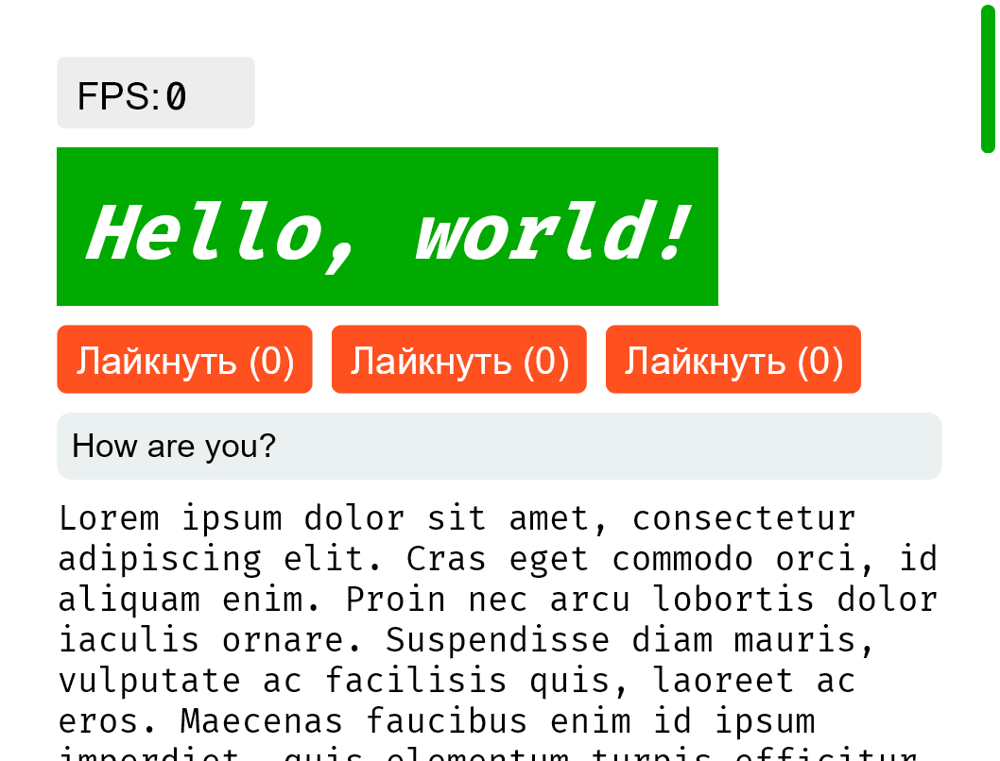
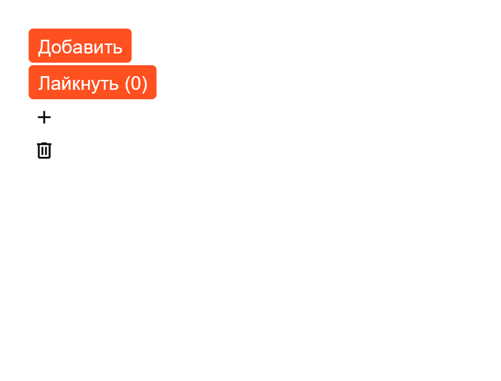
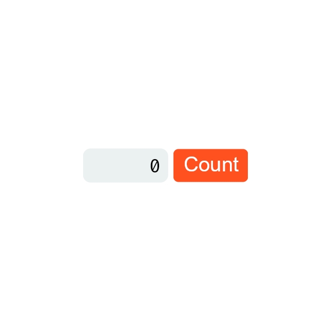
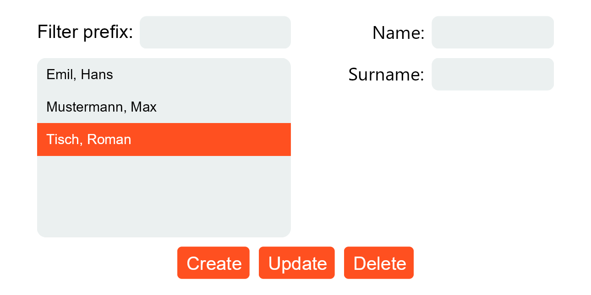
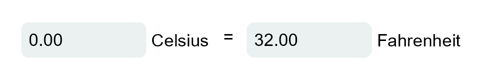
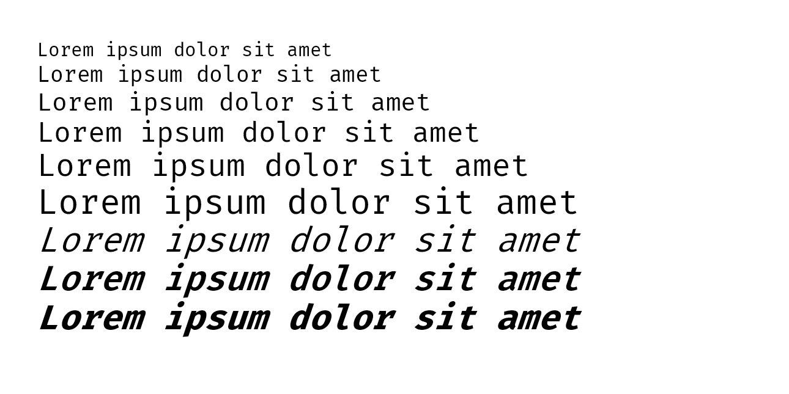
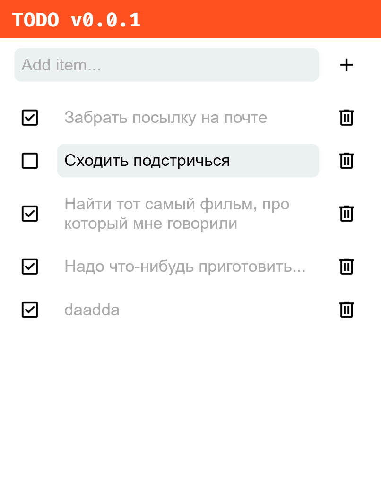

# Elementor

## How to get started

1. Install [XMake](https://xmake.io)

2. Clone the project

    ```bash
    git clone https://github.com/noartem/elementor.git
    cd elementor
    ```

3. Fetch project dependencies

    ```bash
    xmake
    ```

4. *Optional* Set build mode (release/debug/check)

    ```bash
    xmake f -m release -y
    ```

5. Build the project for your system

    ```bash
    xmake build
    ```

6. Check out examples

    ```bash
    xmake run example-gallery
    ```

## Project structure

`src/library` - contains library code   
`src/library/*.(cpp|h)` - library core   
`src/library/platforms` - standard primitive elements library, most of them can be replaced by self-made elements   
`src/platforms` - OS interaction layer   
`src/platforms/gl` - OS interaction layer made with GLFW   
`src/components` - ready-to-use UI components made by standard elements composition, also can be replaced by user
elements   
`src/examples` - example applications used to verify that the library works correctly   
`tests` - various library tests   
`tests/screenshots` - standard examples screenshots used for testing   
`tests/screenshots_new` - newly generated examples screenshots   
`tests/screenshots_diff` - difference between standard and new screenshots

## Run Tests

Run screenshot tests. Screenshots are created by `tests/make_screenshots.cpp` and
compared by `tests/compare_screenshots.py`

```bash
python test.py
```

## Examples

Elementor provides a list of various examples. They are also used for performing screenshot tests.

### 1. Basic

- Rich text rendering
- FPS counter
- Buttons and text field
- Hover and focus support
    - Click on a button and then press Tab - your focus will be moved to the next focusable element (button, text, ...)

```bash
xmake && xmake run example-basic
```

<div>
    
</div>

### 2. Button

- Clickable buttons of different types

```bash
xmake && xmake run example-button
```

<div>
    
</div>

### 3. Counter

- Clickable button
- Updating state

```bash
xmake && xmake run example-counter
```

<div>
    
</div>

### 4. CRUD (readonly)

- Template for a generic CRUD application
- For now, read-only

```bash
xmake && xmake run example-crud
```

<div>
    
</div>

### 5. Temperature Converter

- Text input
- State
- Transforming state

```bash
xmake && xmake run example-tempconv
```

<div>
    
</div>

### 6. Text

- Rich text rendering

```bash
xmake && xmake run example-text
```

<div>
    
</div>

### 7. TODO

- Complex demo application with all previous features combined

```bash
xmake && xmake run example-todo
```

<div>
    
</div>

### All combined

There is also an example application providing all of the previous examples in one window.

```bash
xmake && xmake run examples
```
